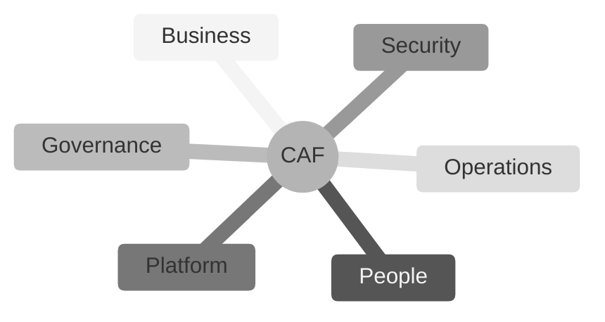

# Domain 1: Cloud Concepts
# (1C: The Cloud Adoption Framework)

## The AWS Cloud Adoption Framework (CAF)

1. **Business Perspective**
   * ROI
   * Business Value
   * C-Level Stakeholders
  
2. **People Perspective**
   * Training
   * Organizational Change
   * Human Resources

3. **Governance Perspective**
   * Risk Management
   * Compliance

4. **Platform Perspective**
   * Architecture and Data Structures
   * Moving from Legacy to Modern

5. **Security Perspective**
   * Access Control (IAM)
   * Data Protection (Encryption)
  
6. **Operations Perspective**
   * Day-to-Day Cloud Management
   * Performance
   * Incident Response

